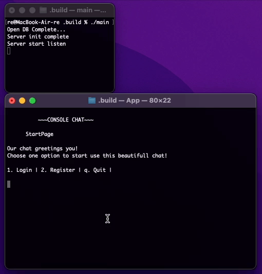

# ConsoleChat

## Тот же чат, но теперь через сеть!

для сборки необходима библиотека sqlite3

**make server** соберет сервер

**make server_logger** соберет сервер с логгером в файл

**make client** соберет клиент

### Пример работы

## Пример работы сервера с логером

